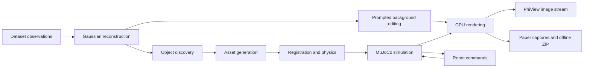

# PhysicalView · PhiView

[](https://github.com/RunyiYang/PhysicalView/actions/workflows/ci.yml)
[](pyproject.toml)
[](LICENSE)

**A server-rendered interface for turning observed scenes into interactive simulations.**
PhiView keeps Gaussian rendering, object selection, scene construction and simulation on
the server. Its browser viewport receives images and sends controls. PhysicalView also
includes the original viser studio for inspecting and editing the construction pipeline.

Load the original Gaussian scene, inspect discovered objects and their physical parameters,
choose generated alternatives, edit the background with a prompt, and interact through
fall/friction tests, throws, projectiles and a robot arm. Paper tools retain original PNGs,
camera/state receipts, editable SVG panels and downloadable offline galleries.



## Start with uv

Install [uv](https://docs.astral.sh/uv/getting-started/installation/), then:

```bash
git clone git@github.com:RunyiYang/PhysicalView.git
cd PhysicalView
uv sync --locked
uv run physicalview --version
uv run physicalview blocks
uv run physicalview doctor --profile cpu
uv run pytest -q
```

This installs the CLI and CPU development environment. GPU rendering and construction
use independent locked environments, so TRELLIS and modern inference can use their
respective PyTorch versions. See [environment profiles](envs/README.md).

```bash
bash tools/env/sync.sh studio
bash tools/env/sync.sh inference
bash tools/env/sync.sh generation
```

Full operation requires access to the separate **SimAny/PhiRoom backend**, licensed input
data and model weights. Sources are pinned in [sources.json](tools/backends/sources.json).
The bootstrap preserves existing checkouts and refuses to overwrite changes:

```bash
uv run python tools/backends/bootstrap.py simany trellis menagerie
uv run physicalview init --simany-root backends/simany --data-root /path/to/scannetpp --splats-root /path/to/splats
uv run physicalview doctor --profile studio --config configs/local.yaml
```

Configure constructed scene outputs and external environment paths in `configs/local.yaml`.
CUDA native extensions and weights are additional prerequisites; `doctor` checks
paths/metadata, not model inference. The backend has its own contribution history and
access requirements.

## Run a block

Use `plan` to inspect the exact commands, then `run` to execute them and save job receipts.
Stages run sequentially and stop when a stage or a declared artifact check fails.

```bash
uv run physicalview plan discovery --config configs/local.yaml --scene ROOM --model sam3_auto
uv run physicalview run discovery --config configs/local.yaml --scene ROOM --model sam3_auto
uv run physicalview run viewer --config configs/local.yaml --scene ROOM_factory
```

The viewer opens the PhiView demo on `127.0.0.1:8095`. For a remote GPU node, use an SSH
tunnel or your site's authenticated proxy. The [controls guide](docs/PHIVIEW.md) covers
WASDQE, mouse look, picking and simulation. `--action studio` opens the original viser
application. Only the PhiView demo enforces the image-only browser contract; the studio
still offers its existing optional client-splat inspection mode.

| Block | Tools / contribution | Branch | Calls and contract |
|---|---|---|---|
| Viewer | gsplat, image streaming, picking, navigation | `block/viewer` | [viewer](pipelines/viewer/README.md) |
| Datasets | ScanNet++, native LIBERO, BEHAVIOR WDS, DROID | `block/datasets` | [datasets](pipelines/datasets/README.md) |
| Reconstruction | posed RGB-D to 3D Gaussians | `block/reconstruction` | [reconstruction](pipelines/reconstruction/README.md) |
| Discovery | SAM3 proposals or annotated segments | `block/discovery` | [discovery](pipelines/discovery/README.md) |
| Generation | TRELLIS, ReconViaGen, SAM 3D adapters | `block/generation` | [generation](pipelines/generation/README.md) |
| Registration | scale/orientation alignment and ICP | `block/registration` | [registration](pipelines/registration/README.md) |
| Inpainting | Qwen image editing and Gaussian refinement | `block/inpainting` | [inpainting](pipelines/inpainting/README.md) |
| Simulation | physical parameters, collisions, MJCF, interactions | `block/simulation` | [simulation](pipelines/simulation/README.md) |
| Robotics | task definitions, scripted IK, OpenPI client | `block/robotics` | [robotics](pipelines/robotics/README.md) |
| Paper | capture, review, SVG panels and offline ZIP | `block/paper` | [paper](pipelines/paper/README.md) |

All blocks are integrated on `main`; switching branches is a development operation.
Shared runtime and release tooling live on `block/runtime` and `block/release`.
`physicalview run full` chains discovery → generation → registration → physical annotation
→ report → MJCF export → task generation. Reconstruction, prompted editing and viewer
launch have separate calls.

## Repository map

```text
physicalview/                 installable application and adapters
  web/                        PhiView image-only browser
  panels/                     original viser studio controls
  resources/pipelines/        packaged block/tool/command manifests
pipelines/<block>/            one documented contract per pipeline block
tools/env/                    uv environment synchronization
tools/backends/               pinned external source bootstrap
tools/validation/             portable package and repository checks
envs/{studio,inference,generation}/  separate pyproject.toml + uv.lock
configs/                      portable defaults and optional cluster example
tests/                        CPU, external-backend and explicit GPU tests
docs/                         architecture, evidence, project and release guides
run/                          historical cluster launchers and experiment scripts
.github/                      CI, draft-release automation and contribution templates
```

`data/`, `weights/`, `backends/` and `outputs/` stay outside source control.

## Evidence and scope

The [project summary](docs/PROJECT_SUMMARY.md) maps every requested demo feature to
implementation and limitations. The [release checks](docs/RELEASE.md) record the new
uv environment validation, including an H200 render with **1,499,998 Gaussians**.
Historical [native reconstruction](docs/NATIVE_DEMO.md), [BEHAVIOR/DROID demos](docs/DEMO_BEHAVIOR_DROID.md)
and [PhiView validation](docs/PHIVIEW_STATUS.md) retain their original run boundaries.

Paper captures are qualitative evidence and require separate visual approval. Current
robot demonstrations use **GT assistance plus scripted IK, not a learned policy**.
General language manipulation, reliable grasp success, exhaustive automatic discovery
and artifact-free scene completion have not been established by these demos.

See [CONTRIBUTING.md](CONTRIBUTING.md), [CHANGELOG.md](CHANGELOG.md) and the
[release procedure](docs/RELEASE.md). Code is MIT; datasets, models and dependencies
retain their own licenses.
